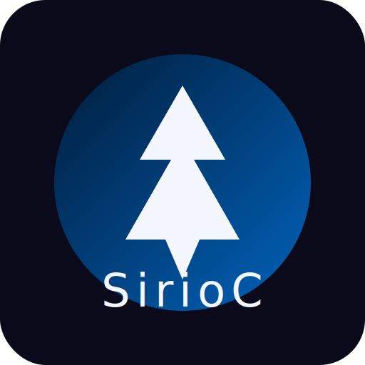

<div align="center">

  

  <h3>SirioC</h3>

  <p>An academic-strength UCI chess engine.</p>
  <p><strong>ID name:</strong> SirioC 1.0 041025 · <strong>ID author:</strong> Jorge Ruiz · <strong>Credits:</strong> Codex ChatGPT</p>

</div>

## Overview

SirioC is a free UCI chess engine that continues the heritage of open-source
computer chess while introducing a new identity and stewardship. The engine is
written in modern C++ and maintains compatibility with the UCI protocol so that
it can be integrated into a broad range of graphical user interfaces.

The project strives for academic clarity: contributions are reviewed for
algorithmic rigor, empirical validation, and reproducibility. SirioC does not
ship with its own graphical front-end; users are expected to pair the engine
with their preferred GUI.

## Project identity

- **ID name:** `SirioC 1.0 041025`
- **ID author:** `Jorge Ruiz`
- **Credits:** `Codex ChatGPT`
- **Primary language:** Modern C++ (C++17 and above)
- **License:** GNU General Public License v3.0 (see `Copying.txt`)

## Files

The SirioC source distribution contains the following key elements:

- [`README.md`](README.md), the document you are currently reading.
- [`Copying.txt`](Copying.txt), the full text of the GNU GPL version 3.
- [`AUTHORS`](AUTHORS), which enumerates the contributors to SirioC.
- [`src/`](src), the complete C++ source tree, including a Makefile that
  facilitates compilation on Unix-like systems.
- `*.nnue`, neural network evaluation files that may be embedded in binary
  distributions.

## Contributing

Please review the [Contributing Guide](CONTRIBUTING.md) before proposing
changes. We welcome rigorous ideas, reproducible experiments, and clear
improvements to playing strength, correctness, or documentation.

### Donating hardware

SirioC relies on large-scale self-play testing. Our SPRT (Sequential Probability
Ratio Test) evaluations are executed in the [FastChess](https://github.com/fastchess/fastchess)
framework on an HP ProLiant DL360p Gen8 server equipped with dual Intel Xeon
E5-2697 v2 processors. The test cluster is made possible through the
collaboration of computer-chess enthusiasts who contribute their time and
hardware expertise.

### Improving the code

The chess programming community maintains extensive documentation on search
techniques, evaluation heuristics, and NNUE technology. We encourage developers
new to SirioC to consult those resources, study the existing implementation, and
accompany changes with empirical evidence produced on the FastChess testing
infrastructure.

## Compiling SirioC

SirioC supports 32-bit and 64-bit architectures, a variety of processor
instruction sets, and big-endian machines. On Unix-like systems it can be built
using the included Makefile:

```
cd src
make -j profile-build
```

Running `make help` lists every supported target and the associated
optimisations. Detailed instructions for Windows, macOS, and Linux environments
are available in the project wiki (forthcoming).

## Terms of use

SirioC is distributed under the terms of the GNU General Public License version
3. You may study, modify, and redistribute the engine—commercially or
otherwise—provided that you comply with the obligations of the GPL. When
redistributing binaries you must accompany them with the corresponding source
code or a written offer to provide it. Modifications must be published under the
same license.

## Credits

SirioC exists thanks to the dedication of Jorge Ruiz, Codex ChatGPT, and a wider
community of collaborators who continue to explore the frontier of computer
chess.

