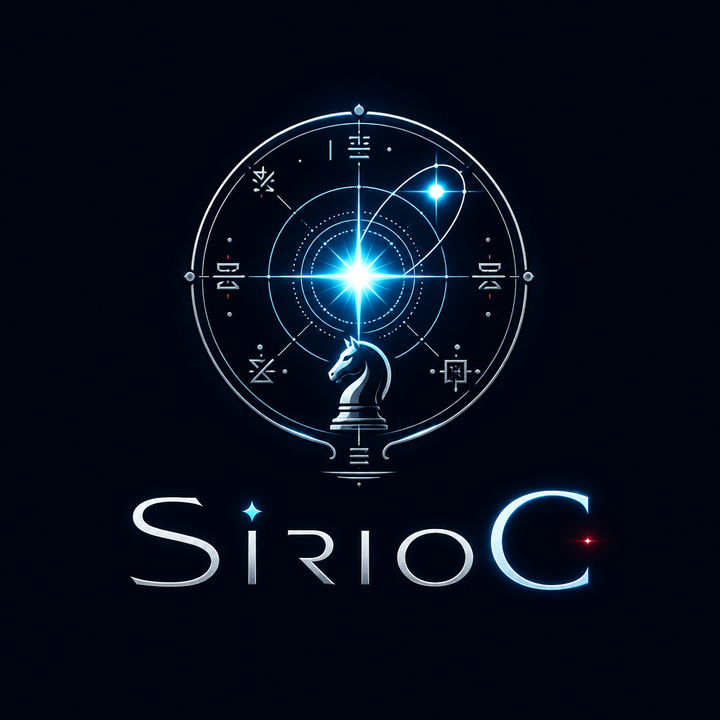

# SirioC



**SirioC** is an original C++20 UCI chess engine by **Jorge Ruiz Centelles**.

Bitboards · UCI · Alpha-beta search · Syzygy · Lazy SMP · Forensic NNUE roadmap · MIT licence

---

## Project identity

SirioC is an original chess-engine project written in C++20. It began as a clear, modular engine base inspired by the educational path of Rustic Chess and is now being developed into a stronger, better-audited UCI engine with a controlled roadmap for search, evaluation and neural-evaluation infrastructure.

The project is authored by **Jorge Ruiz Centelles** and distributed under the **MIT licence**. Any redistribution must preserve the copyright notice and the licence terms.

SirioC studies public engine architecture ideas in the same way modern chess-engine development is built on documented technical lineage: bitboards, alpha-beta search families, transposition tables, history heuristics, neural evaluation and reproducible testing. The project policy is clear: architectural learning is allowed; copying external source code or redistributing external weights without a licence decision is not allowed.

---

## Current status

SirioC is a working UCI chess engine with a useful independent base:

- Board representation with bitboards.
- FEN loading and serialisation.
- Legal move generation with castling, en-passant and check handling.
- Static handcrafted evaluation.
- Iterative alpha-beta/negamax search with quiescence.
- Transposition-table support.
- Late move reductions, null-move pruning, futility-style pruning and aspiration windows.
- Killer moves and quiet-history based move ordering.
- Lazy SMP support.
- Optional Syzygy tablebase probing through Fathom.
- Opening-book support.
- Draw detection for the fifty-move rule, repetition and insufficient material.
- UCI interface for GUI integration.
- Unit tests and reproducible benchmarks.

The current development line is undergoing a forensic refactor so future changes can be audited and merged safely. The first roadmap steps separate search parameters and history state from the large search implementation before deeper selectivity and NNUE work are attempted.

---

## Architecture overview

| Area | Current role |
|---|---|
| Board / FEN / Movegen | Position representation and legal move generation |
| Search | Iterative alpha-beta/negamax with quiescence and pruning |
| Classical evaluation | Stable fallback evaluator |
| Legacy SirioNNUE1 | Historical test/baseline neural path |
| SirioNNUE2 roadmap | Proprietary sparse NNUE path under construction |
| Transposition table | Search memory and move-ordering support |
| Time manager | Clock allocation and move-overhead handling |
| Syzygy / Fathom | Optional tablebase probing |
| Opening book | Optional book moves for testing and tournament use |
| UCI | GUI protocol and engine options |

---

## Main features

### Board and move generation

- Bitboard-based board representation.
- FEN parsing and serialisation.
- Castling rights, en-passant squares and halfmove/fullmove counters.
- Pseudo-legal and legal move generation.
- Check detection through bitboard attacks.
- Castling and en-passant legality handling.

### Search

- Iterative deepening.
- Negamax search with alpha-beta pruning.
- Quiescence search.
- Aspiration windows.
- Null-move pruning.
- Late move reductions.
- Futility-style pruning.
- Static exchange evaluation support where available.
- Transposition-table move ordering.
- Killer moves.
- Quiet-history heuristic.
- Centralised search-parameter header for safer future tuning.
- Extracted `SearchHistory` module for history and killer storage.

### Evaluation

- Classical handcrafted evaluation remains the stable fallback.
- Tapered middle-game/end-game scoring where applicable.
- Piece-square and material terms.
- Mobility and activity terms.
- King-safety terms.
- Pawn-structure terms.
- Bishop-pair bonus.
- Known endgame handling.

### Neural-evaluation roadmap

SirioC currently treats the old piece-count neural path as **legacy/test baseline**. The historical `SirioNNUE1` design is not presented as a competitive modern NNUE architecture.

The current roadmap introduces **SirioNNUE2**, a proprietary neural-evaluation path designed around:

- sparse feature representation;
- deterministic feature-index contracts;
- perspective-aware feature states;
- accumulator-oriented inference;
- binary metadata/header definitions;
- future trainer/export pipeline separation;
- full provenance documentation for networks and datasets.

SirioNNUE2 is being introduced step by step. It must not be considered the default evaluation backend until the encoder, loader, accumulator math, export pipeline, training path and testing framework have been validated.

### Tablebases

- Optional Syzygy integration through the Fathom library.
- Configurable `SyzygyPath` UCI option.
- Probe-depth and probe-limit controls where supported.
- Fifty-move rule awareness for official play.

### Opening book

- Opening-book support where configured.
- Weighted move selection.
- Book enable/disable controls through UCI.
- Useful for reducing early-clock usage in Bullet, Blitz and Rapid testing.

### Time management and SMP

- Adaptive time management.
- Move-overhead support.
- Minimum thinking time.
- Slow-mover style scaling.
- Lazy SMP configurable through the UCI `Threads` option.
- Future roadmap includes stronger PV-stability and score-trend based time allocation.

### Persistence and analysis

- Persistent transposition-table analysis tools where enabled.
- Hash save/load/clear controls.
- Useful for offline analysis, not recommended for official timed matches unless explicitly intended.

---

## Forensic development roadmap

| Phase | Status / objective |
|---|---|
| P0-00 | Guardrails and provenance policy |
| P0-01 | Search-parameter extraction |
| P0-02 | SearchHistory extraction |
| P0-02B | Dedicated history tests |
| P0-03 | SirioNNUE2 backend contract |
| P0-04 | SirioHalfKAv1 sparse feature encoder |
| P0-05 | Python parity encoder and binary exporter |
| P0-06 | Trainer and dataset pipeline |
| P0-07 | Evaluation routing and gauntlets |

### Roadmap principles

- Behaviour-preserving refactors before strength changes.
- Tests before tuning.
- Small mergeable patches.
- No silent search behaviour changes.
- No false NNUE compatibility claims.
- No copied GPL/AGPL code inside the MIT source tree.
- External engines may be used as black-box opponents or documented teachers only when the experiment explicitly allows it.
- Every future dataset and network requires reproducibility metadata.

---

## Originality and provenance policy

SirioC is developed as an original engine. The project may study known public techniques such as alpha-beta search, bitboards, transposition tables, history heuristics, NNUE-style evaluation and SPRT testing. However:

- External source code is not copied into SirioC without an explicit licence decision.
- GPL/AGPL code is not mixed into the MIT source tree by accident.
- External neural-network weights are not redistributed without licence review.
- Future SirioC networks require a `MODEL_CARD.md`.
- Future SirioC datasets require a `DATASET.md`.
- Network files must include checksums, training configuration, dataset manifest and training commit metadata.

This distinction matters: SirioC can be inspired by public engineering practice while still preserving its own codebase, data provenance and authorial identity.

---

## Repository layout

| Path | Purpose |
|---|---|
| `src/board.cpp` | Board representation and FEN handling |
| `src/movegen.cpp` | Move generation |
| `src/search.cpp` | Main search loop and move-ordering integration |
| `include/sirio/search_params.hpp` | Centralised search constants and knobs |
| `include/sirio/history.hpp` | Extracted search-history API |
| `src/history.cpp` | SearchHistory implementation |
| `src/evaluation.cpp` | Classical and neural-evaluation routing |
| `include/sirio/nnue/backend.hpp` | NNUE backend contracts |
| `src/nnue/backend.cpp` | NNUE backend implementation |
| `src/nnue/api.cpp` | NNUE metadata and API surface |
| `src/time_manager.cpp` | Time management |
| `src/tt.cpp` | Transposition-table implementation |
| `src/syzygy.cpp` | Syzygy/Fathom integration |
| `src/uci.cpp` | UCI protocol |
| `tests/` | Unit tests |
| `bench/` | Benchmark utilities |
| `training/nnue/` | Legacy/prototype NNUE training area |

Exact file names may evolve as the forensic refactor progresses. Follow the migration logs under `docs/sirioc_reckless_migration/` for the authoritative development record.

---

## Documentation

- [FEN handling](docs/fen.md)
- [Search and move ordering](docs/search.md)
- [UCI communication](docs/communication.md)
- [UCI GUI integration](docs/gui.md)
- [Engine comparison](docs/engine_comparison.md)
- [Review checklists](docs/review_checklists.md)
- [SirioC migration and provenance logs](docs/sirioc_reckless_migration/)

---

## UCI settings overview

The Arena, Fritz and Cute Chess configuration dialogs expose several UCI options. Exact availability depends on the current build.

### Core performance

#### Threads

Controls how many CPU threads the search uses. SirioC is designed for CPU search. Use physical cores first; hyper-threads may provide diminishing returns.

Recommended approach:

- Bullet: leave spare CPU for the GUI and OS.
- Blitz/Rapid: use most physical cores.
- Classical/analysis: use all available physical cores unless the machine is shared.

#### Hash

Sets transposition-table size in megabytes.

Typical starting values:

- Bullet: 64-128 MB.
- Blitz: 256 MB.
- Rapid: 512 MB.
- Classical/analysis: 1024 MB or more if memory allows.

#### Clear Hash

Clears the transposition table. Use before controlled matches or when changing test conditions.

### Search and analysis output

#### MultiPV / Analysis Lines

Controls how many principal variations are tracked or displayed. Higher values reduce single-line search strength.

Recommended:

- Competitive play: 1.
- Analysis: 2-4, depending on hardware and desired depth.

#### UCI_AnalyseMode

Accepted for GUI compatibility. It may be used by GUIs such as Fritz when entering analysis mode.

#### Skill Level / UCI_LimitStrength / UCI_Elo

Strength-limiting controls should remain disabled or at maximum for serious testing.

### Time management

#### Ponder

Allows thinking on the opponent's time. For automated engine testing, keep **ponder off** unless the test is explicitly designed for ponder.

#### Move Overhead

Adds a safety margin for GUI and system latency.

Suggested starting points:

- Bullet: 250-300 ms.
- Blitz: 150 ms.
- Rapid: 100 ms.
- Classical: 50 ms.

#### Minimum Thinking Time

Prevents the engine from moving instantly in positions where time management would otherwise spend almost no time.

#### Slow Mover

Adjusts how aggressively the engine spends time. Lower values move faster; higher values spend more.

### Opening book

#### UseBook / BookFile

Use an opening book when testing tournament behaviour or conserving time in short controls. Disable it when testing pure engine search from the opening.

### NNUE options

#### UseNNUE / EvalFile / EvalFileSmall / NNUEFile

These options exist for the neural-evaluation path. The legacy path must not be confused with a final competitive SirioNNUE2 network.

Current policy:

- Classical evaluation remains the stable fallback.
- Legacy SirioNNUE1 is treated as a test/baseline path.
- SirioNNUE2 is being developed as an original sparse NNUE path.
- Stockfish `.nnue` compatibility is not claimed as an official SirioC objective.
- External weights must not be redistributed without licence review.

### Syzygy tablebases

#### SyzygyPath

Directory containing Syzygy files (`*.rtbw`, `*.rtbz`). If unset or unavailable, SirioC continues with internal evaluation.

#### SyzygyProbeDepth / SyzygyProbeLimit

Controls when and how broadly tablebases are probed. Use conservative values for Bullet/Blitz and deeper values for Classical/analysis.

#### Syzygy50MoveRule

Should remain enabled for official games.

### Persistent analysis

#### PersistentAnalysis / PersistentAnalysisFile

Useful for long manual analysis sessions. Disable for controlled engine-vs-engine matches unless the test specifically includes persistent hash.

---

## Requirements

- CMake 3.16 or newer.
- A compiler with full C++20 support:
  - GCC 11+;
  - Clang 12+;
  - MSVC 2019 16.10+ or newer.

---

## Building with CMake

```bash
cmake -S . -B build -DCMAKE_BUILD_TYPE=Release
cmake --build build -j
```

The engine binary is normally produced under the build output directory, for example:

```bash
./build/bin/sirio
```

Exact output path may depend on the generator and platform.

---

## Building with Makefile

```bash
make
```

To build and run tests through the Makefile:

```bash
make test
```

---

## Running the engine from command line

The executable can print the initial board or a board from a FEN string:

```bash
./build/bin/sirio "8/8/8/3k4/4R3/8/8/4K3 w - - 0 1"
```

For normal use, load SirioC as a UCI engine in a GUI such as Cute Chess, Arena, Fritz, Banksia or another UCI-compatible interface.

---

## Running tests

```bash
ctest --test-dir build --output-on-failure
```

If the test binary is available:

```bash
./build/sirio_tests
```

or, depending on the build layout:

```bash
./build/bin/sirio_tests
```

---

## Benchmarks

Build benchmarks with CMake or Makefile and run:

```bash
./build/sirio_bench
```

or:

```bash
make bench
```

The benchmark suite is intended to provide reproducible development signals, including speed, tactical checks and optional Syzygy probing where configured.

---

## Syzygy tablebases

SirioC can use Syzygy tablebases when available.

Configuration options:

```text
setoption name SyzygyPath value /path/to/tablebases
setoption name SyzygyProbeDepth value 4
setoption name SyzygyProbeLimit value 6
setoption name Syzygy50MoveRule value true
```

The directory should contain the required `.rtbw` and `.rtbz` files. The full seven-piece set requires very large storage; configure only the tablebases that match your hardware and testing needs.

SirioC uses the Fathom library under `third_party/fathom`. See the corresponding licence file in that directory.

---

## NNUE development status

SirioC is transitioning from a legacy neural-evaluation experiment toward a real proprietary NNUE path.

### Legacy status

The historical SirioNNUE1 path is treated as legacy/test baseline. It should not be described as a competitive modern NNUE comparable to current top-engine neural evaluators.

### SirioNNUE2 target

SirioNNUE2 is intended to become an original SirioC neural-evaluation path with:

```text
sparse feature contract
perspective-aware features
binary metadata/header format
accumulator-oriented inference
future trainer/export pipeline
model and dataset provenance records
```

### Development safety

SirioNNUE2 must pass the following stages before being considered a production evaluation path:

1. C++ feature-index contract.
2. Python parity encoder.
3. Binary exporter.
4. Loader and network validation.
5. Accumulator refresh and incremental update tests.
6. Training pipeline.
7. Baseline-vs-candidate gauntlets.
8. Reproducible release metadata.

---

## Testing philosophy

SirioC changes should be validated through layered checks:

| Layer | Purpose |
|---|---|
| Unit tests | Rules, board state, helper modules, NNUE contracts |
| Benchmarks | Speed and reproducibility |
| UCI smoke tests | GUI-facing protocol stability |
| Gauntlets | Candidate vs baseline strength signal |
| SPRT / ORDO | Statistical promotion criteria |
| Provenance checks | Originality and licence safety |

No change should be promoted on an isolated anecdotal result.

---

## External testing and training tools

Tools such as Cute Chess, fastchess, ORDO, OpenBench, bullet-style trainers or nnue-pytorch-like workflows may be useful externally.

Repository policy:

- External tools stay outside the SirioC source tree.
- OpenBench is a testing/SPRT framework, not an NNUE trainer.
- NNUE training tools must not be vendored into SirioC unless a future explicit licence decision allows it.
- Generated datasets and networks should be stored outside the repository unless a manifest-only tracking task explicitly says otherwise.

---

## Suggested development workflow

```bash
# Configure
cmake -S . -B build -DCMAKE_BUILD_TYPE=Release

# Build
cmake --build build -j

# Run tests
ctest --test-dir build --output-on-failure

# Run engine tests if available
./build/sirio_tests

# Run benchmark if available
./build/sirio_bench
```

Each pull request should report:

- files changed;
- exact scope;
- commands run;
- test results;
- known limitations;
- diffstat;
- confirmation that no external code was copied.

---

## Contributing

Before opening or reviewing a pull request, read:

- `AGENTS.md`, if present;
- `docs/review_checklists.md`;
- `docs/sirioc_reckless_migration/PROVENANCE_POLICY.md`, if present.

Contributions must be small, testable and auditable. Do not mix unrelated search, evaluation, NNUE and UCI changes in the same patch.

---

## Licence

SirioC is distributed under the **MIT licence**. See `LICENSE` for details.

The project may interact with external tools, engines, datasets or tablebases during testing. Those external artefacts keep their own licences and must not be redistributed as part of SirioC unless their terms allow it and the project records the decision explicitly.

---

## Author

**Jorge Ruiz Centelles**

SirioC is part of an ongoing effort to build and document an original UCI chess engine with reproducible testing, careful provenance and a long-term roadmap toward stronger search and neural evaluation.
